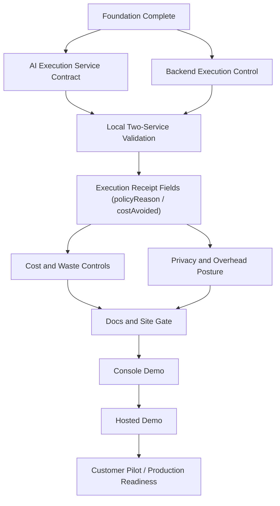

# MVP Dependency Map

## Purpose

This map summarizes the active AI Execution Firewall MVP implementation path across Arbiter repositories and should be read with [`docs/operations/mvp-sellable-completion-gate.md`](../operations/mvp-sellable-completion-gate.md) as the authority for MVP readiness scope and recommended order.

## Active MVP Lane Overview

The sellable MVP completion gate defines readiness as a reproducible local demo with buyer-facing control outcomes: stable execution receipts, visible cost or waste signals, prompt privacy posture validated in demo output, and documentation that explains the result without requiring source code access. The backend foundation is already validated, but remaining MVP readiness depends on completing provider readiness/routing behavior, receipt fields, cost/waste controls, privacy/overhead validation, and site/docs/demo gates in that order.

## Repo Responsibilities

| Repo | MVP responsibility |
|---|---|
| `control-plane-api` | Owns the public execution entry point, request validation, routing decisions, provider readiness gating, budget/control behavior, receipt fields, and Control Plane side of the local demo. |
| `ai-execution-service` | Owns the provider execution boundary, deterministic fake provider behavior, readiness contract, streaming event contract, and service-side execution/correlation behavior used by the Control Plane. |
| `arbiter-console` | Owns only demo-scoped console work after backend APIs are coherent enough to support operational screens. Full customer/operator console workflows remain deferred unless explicitly promoted. |
| `arbiter-site` | Owns public site or docs pages that explain the integration, ROI framing, and demo outcome after backend receipt and AI Waste Report inputs are available. |
| `.github` | Owns cross-repo planning, public-safe organization docs, issue lane policy, label responsibility guidance, and this dependency map. It does not own runtime implementation. |
| `internal-roadmap` | Owns private roadmap and strategic planning context when needed, but private strategy must not be published in this public `.github` repository. |

## Dependency Diagram

Completed foundation nodes and partial receipt/cost-control progress are described in the dependency narrative and the cross-repo issue index.

The exact sequencing between some receipt, cost, privacy, and docs tasks is not fully specified beyond the recommended implementation order in the completion gate. This diagram uses a conservative prerequisite order: backend and service contract first, validated local flow next, buyer-facing receipt fields before demo/site claims, then console/hosted demo work after backend evidence exists.

## Dependency Narrative

Read this section as: foundation, local validation, and base receipt identifiers are complete; backend execution control is in progress for retry suppression, provider readiness/skip, overhead measurement, and pass-through validation; `policyReason`, budget enforcement/route downgrade, `costAvoided`, privacy demo validation, AI Waste Report, site/docs, console, and hosted demo remain planned.

**Backend prerequisites:** This dependency covers Control Plane execution control: cached provider readiness, unhealthy provider skip, retry suppression, pass-through validation, overhead measurement, `policyReason`, budget or route downgrade behavior, and `costAvoided` or equivalent waste signal. Current status: in progress, with receipt field scaffolding, retry suppression structure, and provider readiness routing partially complete. Base receipt identifiers (`executionId`, `correlationId`, `provider`, `model`, `usage`) are available and verified in the final SSE event. `policyReason` and `costAvoided` remain planned. It enables readable receipts, cost/waste demonstrations, and the site/docs/demo gate; without it, buyer-facing MVP claims remain incomplete.

**AI Execution Service prerequisites:** This dependency covers the internal execution boundary, fake/deterministic provider flow, readiness endpoint, stable streaming response behavior, and correlation/execution ID propagation. Current status: complete for the documented local foundation and planned where future receipt or timing fields depend on upstream Control Plane contract work. It enables the local two-service validation path and supports the integration contract used by adopters.

**Local validation prerequisites:** This dependency covers the local Docker two-service flow, health/readiness checks, deterministic provider execution, SSE token/final events, shared execution/correlation identifiers, and clean teardown. Current status: complete for the documented foundation. It enables deterministic demo validation and provides evidence that later receipt, cost, and privacy work can be checked without real provider credentials.

**Console demo prerequisites:** This dependency covers only a minimal demo UI or static receipt view scoped to demo clarity. Current status: planned. It is blocked by coherent backend APIs, receipt fields, and documented demo output; full customer/operator console workflows remain deferred and must not be treated as active MVP blockers.

**Site/docs prerequisites:** This dependency covers the integration guide, AI Waste Report or equivalent demo summary, and an integration overview or ROI-framing page that a buyer can read without source code access. Current status: planned, with the integration contract already documented but requiring verification against final receipt fields before completion. It enables the hosted demo and public-facing MVP explanation.

**Hosted demo gate:** This dependency covers moving from local deterministic validation to a hosted demo that is reproducible, buyer-readable, and consistent with MVP claim guardrails. Current status: planned. It is enabled by completed local validation, receipt fields, cost/waste controls, privacy/overhead validation, and docs/site readiness.

**Security/privacy gate:** This dependency covers prompt privacy posture, metadata-first receipts, no raw prompt logging by default, and separation of Arbiter control overhead from provider/model latency. Current status: planned for explicit demo validation, with default privacy posture described in the integration contract and related overhead measurement (`control-plane-api#149`) and pass-through validation (`control-plane-api#150`) now in progress. It enables trustworthy demo output and prevents site/docs claims from overstating MVP behavior.

## Deferred / Post-MVP Boundaries

The deferred boundaries come from [`docs/issue-lane-policy.md`](../issue-lane-policy.md) and the post-MVP section of [`docs/operations/mvp-sellable-completion-gate.md`](../operations/mvp-sellable-completion-gate.md). These areas must not be treated as active MVP blockers unless explicitly promoted by a human decision:

- Semantic execution primitives.
- Tool Execution Firewall.
- Semantic transactions.
- Replay and simulation.
- Analytics warehouse.
- Durable storage implementation.
- Governance intelligence.
- Enterprise audit/export/compliance suite.
- Token compression and rewriting.
- Marketplace, billing, and team management.

## Cross-Repo Issue Index

| Issue | Repo | Status | Description |
|---|---|---|---|
| [`control-plane-api#133`](https://github.com/arbiter-systems/control-plane-api/issues/133) | `control-plane-api` | in progress | Parent sellable MVP epic for the remaining completion gate work. |
| [`control-plane-api#296`](https://github.com/arbiter-systems/control-plane-api/issues/296) | `control-plane-api` | in progress | AI Execution Firewall MVP release checklist. |
| [`control-plane-api#149`](https://github.com/arbiter-systems/control-plane-api/issues/149) | `control-plane-api` | in progress | Overhead measurement and pass-through posture work referenced by the completion gate and integration contract. |
| [`control-plane-api#150`](https://github.com/arbiter-systems/control-plane-api/issues/150) | `control-plane-api` | in progress | Provider payload pass-through validation referenced by the completion gate and integration contract. |
| [`control-plane-api#151`](https://github.com/arbiter-systems/control-plane-api/issues/151) | `control-plane-api` | in progress | Cached provider readiness and unhealthy provider skip behavior tracked by the completion gate and integration contract. |
| [`control-plane-api#153`](https://github.com/arbiter-systems/control-plane-api/issues/153) | `control-plane-api` | planned | Low-overhead execution path documentation and timing-related receipt posture referenced by the completion gate. |
| [`.github#35`](https://github.com/arbiter-systems/.github/issues/35) | `.github` | complete | Local two-service MVP validation. |
| [`.github#36`](https://github.com/arbiter-systems/.github/issues/36) | `.github` | planned | Hosted demo deployment readiness checklist. |
| [`.github#37`](https://github.com/arbiter-systems/.github/issues/37) | `.github` | complete | Required PR quality gates. |
| [`.github#43`](https://github.com/arbiter-systems/.github/issues/43) | `.github` | complete | MVP release readiness checklist. |
| [`.github#55`](https://github.com/arbiter-systems/.github/issues/55) | `.github` | complete | Issue lane policy exists and classifies active MVP, deferred/post-MVP, ready, and blocked work for AI agents. |
| [`.github#64`](https://github.com/arbiter-systems/.github/issues/64) | `.github` | complete | GitHub Project operating model documentation. |

## Related Docs

- [MVP Sellable Completion Gate](../operations/mvp-sellable-completion-gate.md)
- [MVP Backend Baseline](../operations/mvp-backend-baseline.md)
- [MVP Execution Gateway Integration Contract](../operations/mvp-execution-gateway-integration-contract.md)
- [Issue Lane Policy](../issue-lane-policy.md)
- [Web and Console Timing Checklist](../planning/web-console-timing.md)
- [Local Two-Service Docker Validation - 2026-05-16](../operations/local-two-service-validation-results.md)
